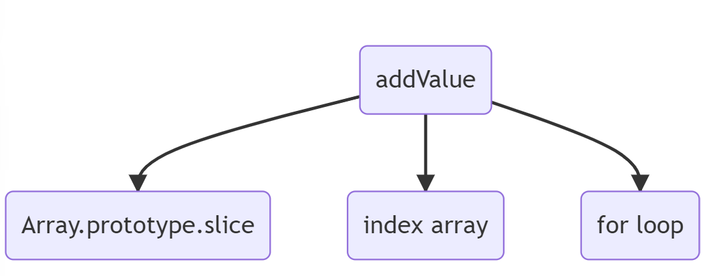

# CHAPTER 8 - 계층형 설계 I

### 소프트웨어 설계(Software design)

소프트웨어의 개발 단계는 다음과 같다.

```
요구사항 분석 > 설계(design) > 구현 > 테스트 > 유지보수
```

설계 단계는 요구사항을 분석 후 가장 처음 진행되는 단계이다. 설계를 잘할수록 구현, 테스트, 유지 보수가 쉬워진다. 그래서 개발 과정에서 설계에 많은 시간을 쏟게 된다.

### 계층형 설계(Strafied design)

계층형 설계에서 계층(layer)은 동일한 목적을 가진 코드 영역이다. 코드를 목적에 나누어 작성하면 관심사를 분리할 수 있게 된다.

### 호출 그래프(Call graph)

호출 그래프란 루틴과 서브 루 간의 흐름을 그래프로 표현하는 방법이다. 간선의 방향은 위에서 아래로 향하며, 화살표는 루틴이 서브 루틴을 호출하는 행위를 의미한다. 계층형이기 때문에 트리라고 헷갈릴 수 있지만, 노드의 부모가 두 개 이상 존재할 수 있으므로 그래프이다.

함수형 프로그래밍에서는 노드를 함수 또는 언어 차원의 기능을 가리킨다. 간단히 호출 그래프를 하나 그려보자.

```js
function addValue(nums, value) {
	const copy = nums.slice();

	for (let i = 0; i < nums.length; i += 1) {
		nums[i] += value;
	}

	return nums;
}
```



위 그림에서 addValue는 상위 계층, 나머지 서브 루틴은 하위 계층으로 표현할 수 있다.

### 직접 구현 패턴

직접 구현은 계층형 설계를 구현하기 위한 패턴 중 하나이다. 직접 구현은 호출 그래프의 간선의 길이가 동일하도록 변경하는 방법이다. 결국은 간선의 길이를 줄이는 게 핵심이다.

간선의 길이를 줄이는 방법은 노드와 노드 간 중간 노드를 거치면 된다. 이렇게까지 길이를 동일하게 하는 이유는 함수의 길이를 줄여 복잡도를 낮추고, 계층을 분리하고, 재활용한 로직을 뽑아내려고 하는 것 같다.

직접 구현 패턴은 다음과 같은 과정을 거쳐야 한다.

1. 호출 그래프를 그려본다
2. 호출 그래프의 간선의 길이를 동일하게 맞춘다. (노드 간 중간 노드를 만든다.)

참고) 직접 구현 패턴 관련 연습문제는 아래 파일을 확인해보자.  
[연습 문제](./homework.js)

### 생각 정리

<b>어떻게 팀 단위에서 추상화 수준을 유지할 수 있을까?</b>

계층은 추상화 수준이라고 말할 수 있다. 추상화 수준이 높아질수록 개발의 생산성은 떨어질 수 있다. 하지만 반대급부로 코드의 재사용성은 증가하게 된다.

추상화의 핵심은 일관성이다. 하지만 팀 단위로 작업을 하다 보면 추상화 수준을 놓고 의견 차이가 발생할 수밖에 없다. 어떤 이는 "이 로직도 분리하자!"라고 할 수 있고, 다른 이는 "다음에 하자.. 급한 게 많아"라고 할 수 있다. 합의되지 않는 추상화는 일관성을 확보할 수 없게 되며 코드를 갈아엎을 가능성을 높이는 행위일 수 있다.

결국은 팀, 프로젝트의 상황에 맞게 추상화 수준을 논의해야 할 것 같다.

<b>어떻게 안전하게 추상화할 수 있을까?</b>

함수형 프로그래밍의 추상화를 완벽하게 하기 위해서는 함수를 작게 분리해야 한다. 점점 함수의 개수는 많아질 것이다. 그런데 동시에 함수의 안정성을 확보할 수 있을까? 매번 프로젝트에 보일러 플레이트를 적용하는 게 맞을까? 필요할 때마다 서브 함수를 직접 구현하는 게 맞을까?

안전하지 않는 함수는 심각한 오류로 이어질 수 있다. 또한 여러 프로젝트에 중구난방으로 흩어진 서브 함수 로직을 통합하는 건 꽤 힘든 일이다.

함수형 프로그래밍 필요성, 작성 방법을 알고 있다면 괜찮은 라이브러리를 도입해보는 건 어떨까?
